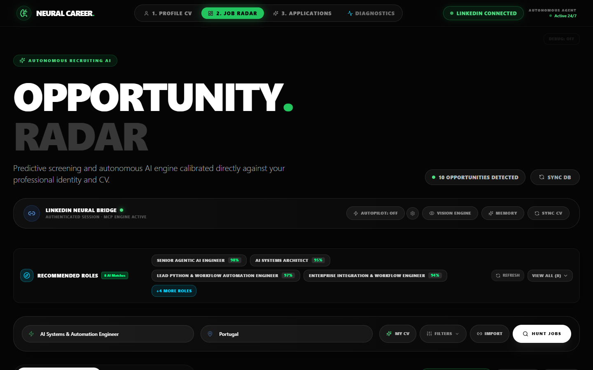
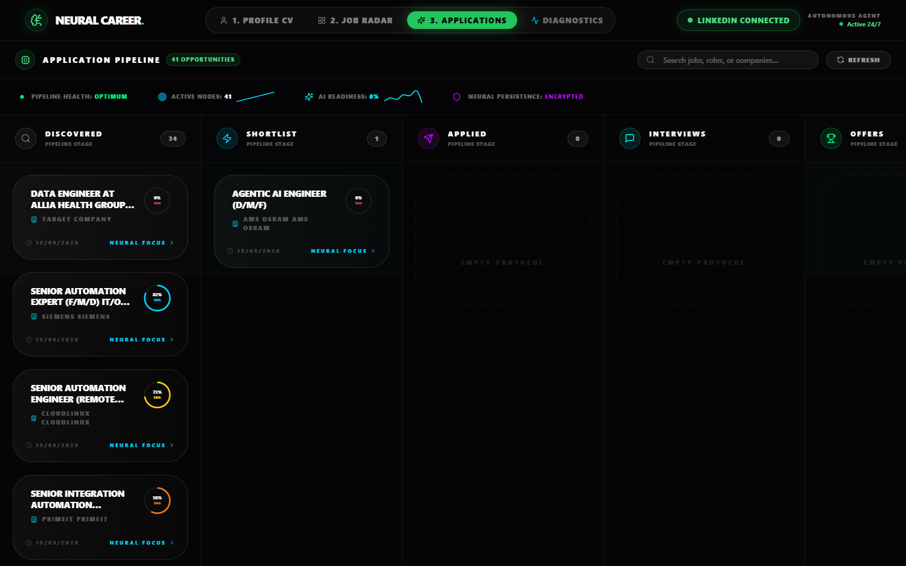
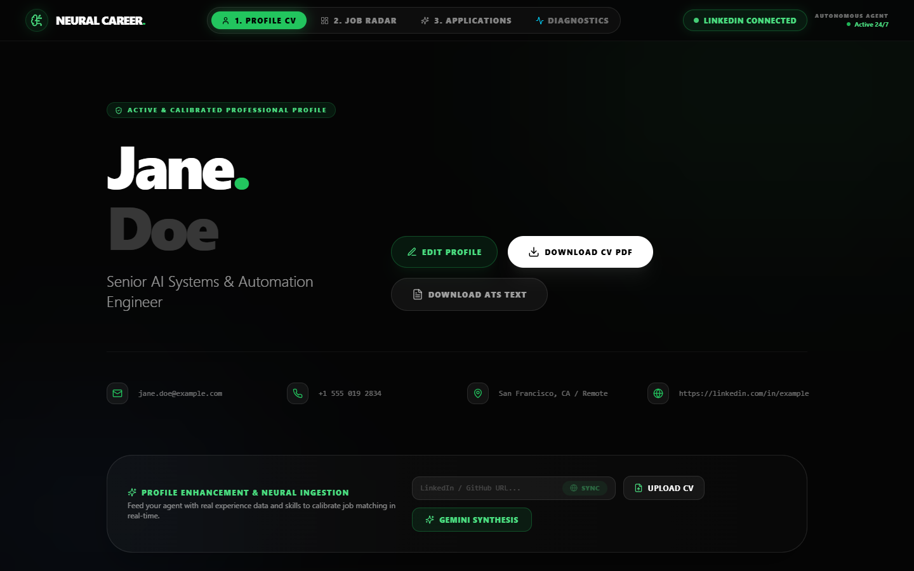

# 🧠 LinkedIn Jobfinder Scout — Autonomous Career Intelligence Engine (2026 Edition)

[](https://github.com/alyekseyenko/linkedin-jobfinder-scout/actions)
[](https://github.com/alyekseyenko/linkedin-jobfinder-scout/releases)
[](https://python.org)
[](https://nodejs.org)
[](docker-compose.yml)
[](https://github.com/langchain-ai/langgraph)
[](postgres/init.sql)
[](LICENSE)
[](docs/SECURITY.md)

> [!NOTE]
> **Educational & Research Notice:** This project is an open-source research and engineering showcase for multi-agent systems, human-in-the-loop browser automation, and vector memory. Always comply with the target platforms' terms of service and acceptable use guidelines.

> **"Manual job hunting is obsolete. Welcome to Agentic Career Intelligence."**

**LinkedIn Jobfinder Scout** is an open-source, high-performance recruitment intelligence and autonomous job application platform designed to automate, analyze, and optimize your career trajectory. 

Operating on a **Dual-Memory Neural Architecture (Candidate Memory vs. Market Memory)**, it integrates a **Swarm of 6 Specialized AI Agents** (LangGraph + CrewAI), **ResumeSkills Action-Verb Technical Engine**, **Semantic Knowledge Graph Reasoning**, **pgvector Vector Database**, **2-Page ATS-Optimized PDF Export**, **Native 1-Click LinkedIn Authentication**, and **Autonomous Vision-Guided Playwright Auto-Fill with Human-in-the-Loop (HITL)** to decode job postings, extract real company forensics, and complete multi-step applications safely.

---

## 📸 Interface Preview

### 1. Job Radar & Match Scoring


### 2. Application Kanban Pipeline


### 3. Digital Twin CV & Knowledge Engine


---

## 🎮 Try It Instantly — No API Keys Required

```bash
git clone https://github.com/alyekseyenko/linkedin-jobfinder-scout.git
cd linkedin-jobfinder-scout
docker compose --env-file .env.demo up
# Open → http://localhost:5173
```

Demo mode serves pre-computed analysis results so you can explore the full UI,
Pipeline Kanban, HITL cockpit, and agent interface without any subscription.
→ **[Full demo guide](docs/DEMO.md)**

---

## 🏗️ System Architecture

```
┌─────────────────────────────────────────────────────────────────┐
│  FRONTEND  React 19 + TypeScript + Three.js           :5173     │
└──────────────────────────┬──────────────────────────────────────┘
                           │ REST / SSE
┌──────────────────────────▼──────────────────────────────────────┐
│  BACKEND   Node.js + Express                          :3004     │
│  ┌───────────────┐ ┌──────────────┐ ┌───────────────────────┐  │
│  │  REST Router  │ │  BullMQ      │ │  Playwright HITL      │  │
│  │  Zod + Rate   │ │  Worker      │ │  Auto-Fill Engine     │  │
│  │  Limiter      │ │  (isolated)  │ │  + Session Vault      │  │
│  └───────┬───────┘ └──────┬───────┘ └───────────────────────┘  │
└──────────┼────────────────┼─────────────────────────────────────┘
           │                │ Redis Queue
┌──────────▼────────────────▼─────────────────────────────────────┐
│  AI ENGINE  Python + FastAPI + LangGraph              :8001     │
│  ┌───────────────────────────────────────────────────────────┐  │
│  │  3-Tier Cascading Router  (>90% token cost savings)       │  │
│  │  Tier 1: Free heuristics  → Tier 2: Groq → Tier 3: Elite │  │
│  └───────────────────────────┬───────────────────────────────┘  │
│  ┌────────────────────────────▼──────────────────────────────┐  │
│  │  6-Agent LangGraph Swarm                                  │  │
│  │  Scout → Forensics → Evidence → Crafter → Judge          │  │
│  └───────────────────────────────────────────────────────────┘  │
│  ┌──────────────┐ ┌────────────────┐ ┌────────────────────┐    │
│  │ Semantic     │ │ LLM-as-a-Judge │ │ Arize Phoenix OTLP │    │
│  │ Cache <5ms   │ │ Hallucination  │ │ Distributed Trace  │    │
│  └──────────────┘ └────────────────┘ └────────────────────┘    │
└────────────────────┬────────────────────────────────────────────┘
                     │
┌────────────────────▼────────────────────────────────────────────┐
│  DATA   PostgreSQL 16 + pgvector │ Redis 7 │ Qdrant (optional)  │
└─────────────────────────────────────────────────────────────────┘
```

| Layer | Technology | Responsibility |
|---|---|---|
| **Presentation** | React 19 + TS + Three.js + Framer Motion | Dashboard, Pipeline, HITL Review |
| **Orchestration** | Node.js + Express + BullMQ + Playwright | API, Queue Worker, Browser Automation |
| **Cognitive** | Python + FastAPI + LangGraph + CrewAI | 6-Agent Swarm, Cascading Router, Judge |
| **Persistence** | PostgreSQL + pgvector + Redis | Vector Memory, Dual-Memory, Queue |
| **Observability** | Arize Phoenix + OTLP + Correlation IDs | Distributed Tracing, Agent Telemetry |

→ **[Full architecture deep-dive](docs/ARCHITECTURE.md)** | **[Agent design decisions](docs/AGENT_DESIGN.md)**

---

## 🧪 Running Tests

```bash
# Python AI Engine (pytest)
cd backend_ai && pip install -r requirements.txt
pytest test_ai_service.py test_evals_benchmark.py -v

# Node.js Backend (node:test — built-in, no jest needed)
cd backend && npm ci
node --test test/system.test.js test/services/*.test.js

# Frontend TypeScript check + build
cd frontend && npm ci && npm run typecheck && npm run build
```

---

## ⚡ 1-Click Launch

### Windows
Double-click the automatic launcher:
👉 **`start-neural-scout.bat`**

### Linux / macOS
```bash
chmod +x ./start-neural-scout.sh
./start-neural-scout.sh
```

The startup script automatically:
1. Generates `.env` and `backend/user_cv.json` from templates if missing.
2. Checks Docker daemon status.
3. Launches all microservices (`postgres`, `ai-engine`, `neural-backend`, `neural-ui`, `qdrant`).
4. Registers the native protocol handler for 1-Click browser authentication.
5. Automatically opens the Dashboard in your browser at **`http://localhost:5173`**.

---

## 🛠️ Quickstart (Manual Setup)

### 1. Clone & Setup Files
```bash
git clone https://github.com/alyekseyenko/linkedin-jobfinder-scout.git
cd linkedin-jobfinder-scout

# Copy environment & profile templates
cp .env.example .env
cp backend/user_cv.example.json backend/user_cv.json
```

### 2. Configure Environment & Candidate CV
- Edit `.env` with your API keys:
  - `GROQ_API_KEY`: Ultra-fast inference for Llama 3.3 70B & DeepSeek R1 via [console.groq.com](https://console.groq.com/)
  - `GEMINI_API_KEY`: Multimodal Vision & Reasoning via [aistudio.google.com](https://aistudio.google.com/)
- Edit `backend/user_cv.json` with your real work history, quantifiable achievements, skills, and contact information.

### 3. Start with Docker Compose
```bash
docker compose up --build -d
```

---

## 🔗 Microservice Ports & Web Dashboards

| Service | Port / URL | Description |
| :--- | :--- | :--- |
| **Neural UI (Dashboard)** | [http://localhost:5173](http://localhost:5173) | Main Job Discovery, Market Intelligence & Application Cockpit |
| **Backend API** | [http://localhost:3004](http://localhost:3004) | Orchestration Server, MCP Client & Auto-Fill Gateway |
| **AI Engine Swagger API** | [http://localhost:8001/docs](http://localhost:8001/docs) | FastAPI Interactive Agentic Endpoint Documentation |
| **PostgreSQL Database** | `localhost:5432` | Local PostgreSQL + pgvector Dual-Memory Database |
| **Qdrant Vector DB** | [http://localhost:6333/dashboard](http://localhost:6333/dashboard) | High-Speed Vector Storage & Embeddings Dashboard |
| **Arize Phoenix** | [http://localhost:6006](http://localhost:6006) | Real-time OTLP Agentic Tracing & Telemetry |

---

## 🔑 Native 1-Click LinkedIn Authentication & Zero-Trust Vault

Connecting your LinkedIn profile no longer requires manually inspecting DevTools or copying sensitive cookies into text files:

- **1-Click Native Browser Flow (`neural-login://auth`)**:
  - Clicking **"Connect LinkedIn"** in the header triggers a custom native system URI handler that opens Google Chrome in your active desktop session.
  - You log in securely on LinkedIn as usual.
  - The system detects your active feed, automatically intercepts the session authentication token (`li_at`), and transfers it to the secure backend.
- **Zero-Trust Encrypted Vault (`vault_service.js`)**:
  - Session tokens and credentials are encrypted at rest using AES-256-GCM.
  - Tokens are injected ephemerally into isolated Playwright browsing contexts without persisting plaintext credentials to shared disk images.
- **Full Logout Lifecycle (`POST /api/auth/linkedin/logout`)**:
  - One-click session revocation purges the Vault cache, session cookies, and environment variables instantly.

---

## 🤖 Live Auto-Fill Cockpit (Human-in-the-Loop — HITL)

Autonomous application submission with guaranteed human oversight:

```
┌────────────────────────────────────────────────────────────────────────┐
│  🌐 AUTONOMOUS APPLICATION PIPELINE                                    │
│                                                                        │
│  [Job URL] ➔ [Session Injection] ➔ [Form Detection] ➔ [pgvector RAG]   │
│      │                                                     │           │
│      ▼                                                     ▼           │
│  Playwright Stealth                              Contextual Screening  │
│  Browser Engine                                  Question Resolution   │
│                                                            │           │
│  🛑 HITL SAFETY GATE: Final Review Stop ────────────────────┘           │
│      │                                                                 │
│      ▼                                                                 │
│  Live Screenshot Preview & Candidate Manual "Submit" Approval          │
└────────────────────────────────────────────────────────────────────────┘
```

1. **Automatic Session Injection**: Directly inherits your authenticated LinkedIn session from the Vault into Playwright, bypassing login walls.
2. **Dynamic Easy Apply Navigation**: Detects and navigates multi-step LinkedIn Easy Apply dialogs, filling candidate details (phone, email, portfolio links).
3. **Contextual Screening Q&A**: Queries `candidate_memory` in pgvector to answer employer-specific questions (e.g., years of experience with Python/Docker, notice period, work authorization).
4. **Human-in-the-Loop Safety Stop**:
   - The bot automatically **halts execution at the final review screen** (`Review Application`).
   - A real-time screenshot is streamed to the frontend dashboard.
   - **No application is submitted without your explicit confirmation.**

---

## 📊 Market Intelligence & Recommended Roles Engine

Integrated directly into the header bar, the **Market Intelligence Engine** evaluates your CV against European and remote hiring trends:

- **8 Strategic Roles Across 4 High-Growth Categories**:
  - **🤖 Autonomous Agents**: *Senior Agentic AI Engineer*, *AI Systems Engineer*
  - **⚡ Automation & Python**: *Senior Python Automation Engineer*, *Digital Transformation & AI Lead*
  - **🧠 RAG & Knowledge Systems**: *Enterprise RAG & Knowledge Systems Engineer*, *LLM Application Developer*
  - **🏛️ Architecture & MLOps**: *AI Infrastructure & MLOps Engineer*, *Principal AI Solutions Architect*
- **Market Demand Signals**: Live salary benchmarking (e.g., *€70,000 - €105,000 / yr*), active job volume indicators (e.g., *350+ openings*), and match score justification.
- **1-Click Search Binding**: Selecting any recommended role instantly loads optimized recruiter-grade search queries into the Discovery Engine without triggering accidental automated mass scraping.

---

## 📐 Technical Decisions (Staff/Principal Architecture)

1. **pgvector vs. Cloud Vector DBs**: Chose PostgreSQL with `pgvector` for dual-memory storage (Candidate vs. Market Memory) to guarantee 100% offline data sovereignty, zero ongoing infrastructure costs, and transactional ACID consistency with relational job records.
2. **LangGraph vs. Linear Chains**: Adopted LangGraph stateful multi-agent graphs to orchestrate cyclical feedback loops (`Scout` → `Forensics` → `Crafter` → `Recruiter Mirror` self-correction) rather than naive sequential pipelines.
3. **BullMQ / Redis vs. Polling Interval**: Migrated background AI analysis and high-latency web scrapers into an isolated BullMQ worker process with concurrency control, retry backoff with jitter, and rate-limit quarantine.
4. **Cascading 3-Tier Inference**: Implemented an automated confidence cascade routing jobs to fast/free models for initial triage (<60% match) and reserving heavy multimodal models only for elite opportunities (>=80%), slashing API billing by >90%.
5. **Zero-Trust Session Vault (AES-256-GCM)**: Authenticated cookies and tokens are encrypted at rest with PBKDF2 key derivation and injected ephemerally into Playwright browsing contexts without ever writing plaintext credentials to shared Docker volumes.

---

## ❓ Useful Commands

```bash
# View live container logs
docker compose logs -f

# Check backend logs specifically
docker compose logs -f neural-backend

# Stop all microservices
docker compose down

# Rebuild containers from scratch
docker compose up --build -d
```

---

## 🛡️ Privacy & Security

- **100% Local Execution**: All CV data (`user_cv.json`), vector memories, and database records remain strictly on your local machine.
- **Zero-Trust Token Storage**: LinkedIn session cookies are stored in an AES-256 encrypted vault, never committed to git or exposed in plaintext logs.
- **Safety-First Automation**: The system is designed strictly as a Human-in-the-Loop co-pilot; it never submits applications or dispatches outreach messages without explicit human approval.

---

## 📄 License

Distributed under the **MIT License**. Free for personal and open-source use.
