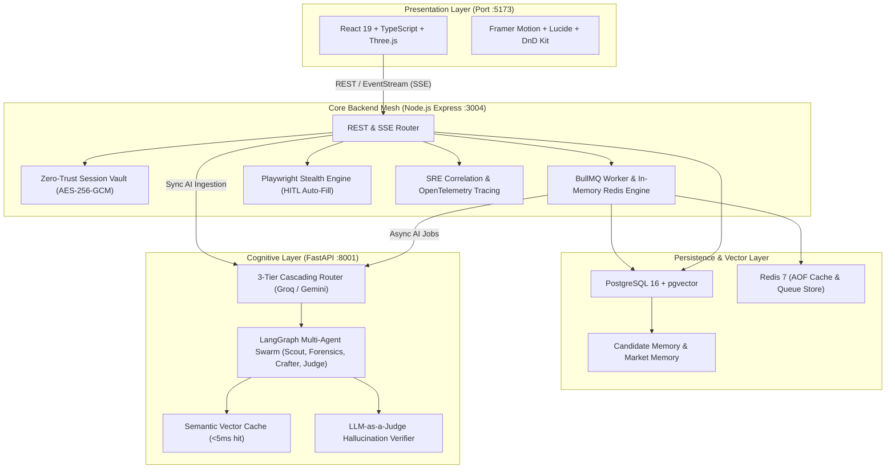

# 🏗️ Architecture Design & System Topology

The LinkedIn Neural Scout platform is built upon a distributed, fault-tolerant microservice architecture designed to execute autonomous career intelligence, deep forensic analysis, and human-in-the-loop workflows.

---

## 🏛️ Component Responsibilities

1. **Presentation Layer (`frontend/`)**:
   - High-performance, 60 FPS React 19 interface with Three.js neural background.
   - Real-time SSE streaming for live inspection of multi-agent reasoning steps.
   - Interactive Kanban Pipeline with drag-and-drop mechanics.

2. **Core Backend Service (`backend/`)**:
   - Zero-Trust Session Vault with AES-256-GCM PBKDF2 encryption.
   - Dedicated BullMQ analysis worker isolated from Express event-loop.
   - Anti-bot evasive browser automation via Playwright with WebGL/Canvas spoofing.
   - Prometheus metrics endpoint (`/api/metrics`) and OpenTelemetry Correlation tracing.

3. **Cognitive AI Engine (`backend_ai/`)**:
   - 3-Tier Cascading Router that executes free/fast LLMs for initial triage and reserves elite models for final pitch crafting.
   - LangGraph collaborative multi-agent architecture with closed-loop validation.
   - LLM-as-a-Judge evaluator ensuring zero hallucinations against verified candidate knowledge.
